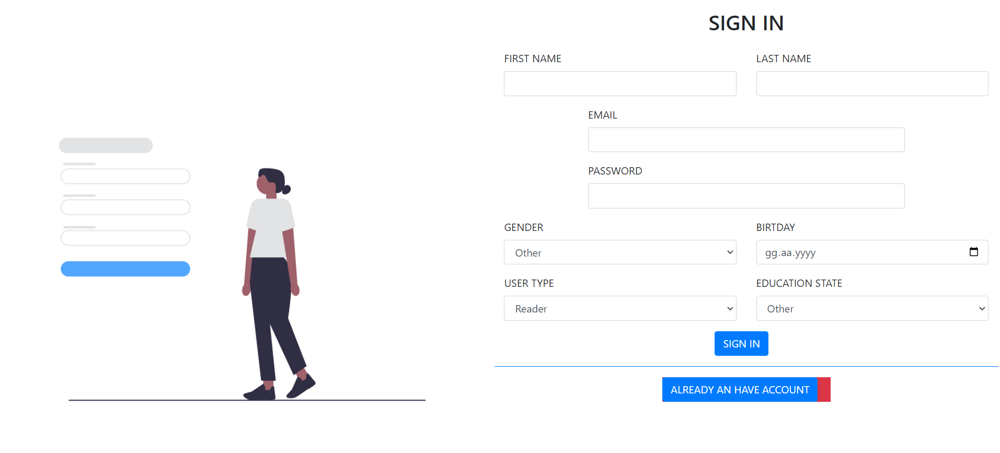
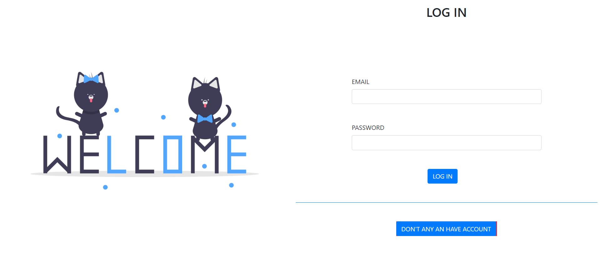
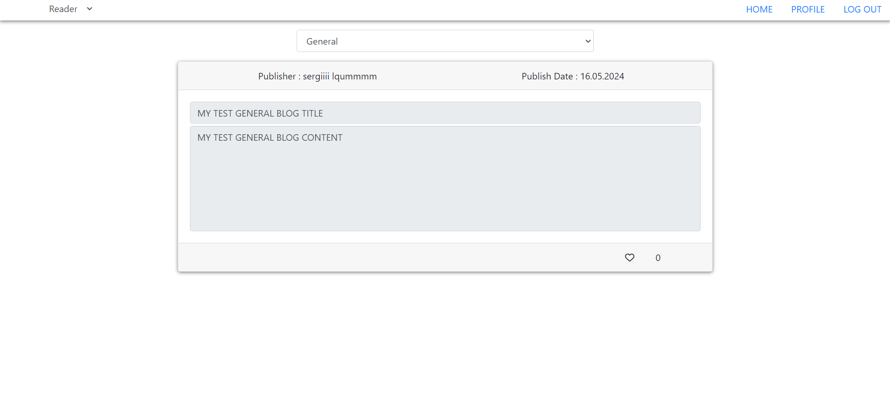
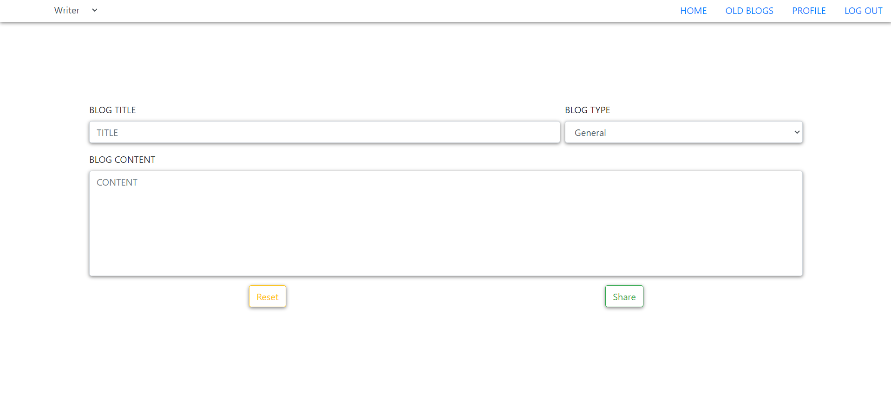
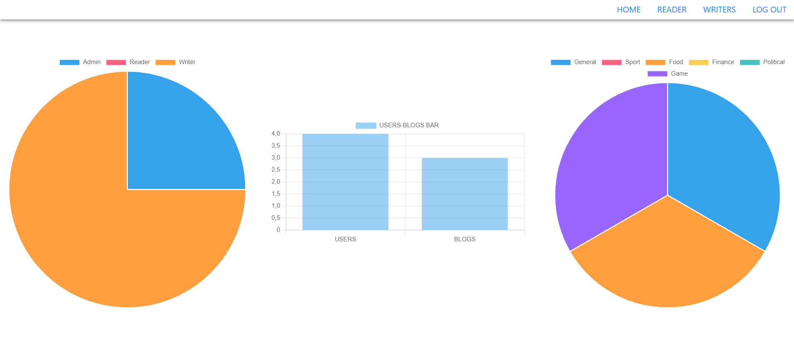

# Project Overview

Our project is a blog platform. Initially, when a user visits the site, they are presented with a registration page. If they do not have an account, they can fill out the required information to create one and be redirected to the appropriate page based on their selected role. If they already have an account, they can go to the login page and enter their email and password to be directed to the appropriate page according to their role.

There are three different user roles in the project, and upon registration, the role is determined from the provided information. When logging in, users are redirected accordingly.

Users with the Writer role can create and share new blog posts, edit or delete their previous posts, and update their profiles. Users with the Reader role can select a blog category and read blogs within that category. They can also like or unlike posts and update their profiles. The Admin role is pre-registered and does not require a typical sign-up process.

Upon accessing the admin page, the admin is presented with three different charts related to blogs, users, and their interactions. The admin can view users with Reader and Writer roles in separate tables, along with their details. The admin can edit user information and delete users. If a user is deleted, their blogs are also deleted, and any likes they had given are adjusted accordingly. Additionally, users with Reader and Writer roles can switch roles from their main pages. These role changes are updated in Firebase so that the next time they log in, they are correctly redirected to the appropriate page.

This is a brief summary of our project.

## Steps to Work with Docker

To run the project using Docker, follow these steps:

### **Install Docker:**
   - Ensure you have Docker installed on your system. You can download and install Docker from [here](https://www.docker.com/get-started).

### **Clone the Repository:**
   - Open your terminal and run the following commands to clone the repository and navigate to the project directory:
     ```bash
     git clone https://github.com/YusufDemir0/BlogProject0
     cd BlogProject0
     ```

### **Start the Project with Docker Compose:**
   - Run the following command to start the project using Docker Compose:
     ```bash
     docker-compose up
     ```
   - This will build the Docker images and start the containers. The application will be accessible at `http://localhost:3000`.

## Steps to Work with GitHub Codespaces

### **Open Your Project in Codespaces:**

- Go to your project repository on GitHub.com.
- Click the "Code" button on the repository's main page.
- In the dropdown menu, select "Open with Codespaces."
- Create a new Codespace or open an existing one.

### **Use the Development Environment:**

- Once the Codespace is open, you'll see a fully-featured Visual Studio Code environment.
- Open the terminal by pressing `Ctrl +` or by selecting `Terminal > New Terminal` from the menu.
- Run the following commands to install dependencies and start your project:
   ```bash
   npm install
   npm start
These commands will start the project and allow you to test it in the browser.

## Usage

This project provides a platform where users can write, read, and manage blog posts. Below are step-by-step instructions on how to use the project.

### 1. Login and Registration

- **Registration Page:**
  - When you start the project, you will first encounter the login or registration page.
  - If you are a new user, you can create an account by filling out the registration form.
  - If you already have an account, you can log in to continue.



### 2. Homepage

After logging in, you will be directed to different homepages depending on your user type:

- **Reader:**
  - Once logged in, you will be directed to a page listing the blogs you can read.
  - You can filter blogs by category.
  - 

- **Writer:**
  - Once logged in, you will be directed to a page where you can add new blog posts.
  - You can write blogs based on the category of your choice.
  - You can edit or delete the blogs you have previously written.
  - 

- **Admin:**
  - As an admin, you will have access to a control panel where you can manage all blogs and users.
  - You have full authority over all content and users.
  - 

### 3. User Profile

- **Profile Management:**
  - After logging into your account, you can access your user profile.
  - From the profile page, you can change your user type (e.g., from reader to author).
  - You can update your personal information.

### 4. Blog Management (for Writers)

- **Writing a New Blog:**
  - Click on the "Write New Blog" button to create a new blog post.
  - Fill in details like title, content, and category to create and publish your blog post.

- **Editing and Deleting Blogs:**
  - From the page listing your previously written blogs, select the blog you want to edit or delete.
  - You can edit the blog and save the changes or delete it entirely.

### 5. Admin Controls

- **Managing All Content:**
  - As an admin, you can edit or delete all users' blog posts.
  - You can manage user account information and change user types.
- **Admin Login:**
  - Use the following credentials to log in as an admin:
    - **Username:** admin@gmail.com
    - **Password:** 123123


By following these steps, you can efficiently use and manage the project. If you encounter any issues or need more information, please refer to the project documentation.

## Creators

- Egemen Çakır  200201052
- Halil Asav  210201097
- Yusuf Demir  210201009
